<div align="center">
  <a class="header-badge" target="\_blank" href="https://www.linkedin.com/in/haroldarriolanucamendi/">
    
  </a>
  <a class="header-badge" target="_blank" href="https://developer.mozilla.org/en-US/docs/Web/JavaScript/">
    
  </a>
</div>

# Welcome to JavaScript

JavaScript is a lightweight, interpreted, multi-paradigm language, and features first-class functions. It is a single-threaded language and is dynamically typed.

# Table of Contents

- [Welcome to JavaScript](#welcome-to-javascript)
- [Table of Contents](#table-of-contents)
- [Installation and configuration](#installation-and-configuration)
  - [Brew | Mac](#brew--mac)
  - [VSCode | Mac](#vscode--mac)
  - [Node | Mac](#node--mac)
    - [Without Brew](#without-brew)
    - [With Brew](#with-brew)
  - [Other | Mac](#other--mac)
  - [VSCode | Windows](#vscode--windows)
  - [Node | Windows](#node--windows)
- [Running Programs](#running-programs)
  - [Running in the browser](#running-in-the-browser)
  - [Running in Node](#running-in-node)
- [Hello World Program](#hello-world-program)
- [JavaScript Best Practices](#javascript-best-practices)
  - [JavaScript Typing](#javascript-typing)
  - [Naming Variables](#naming-variables)
  - [Naming Classes](#naming-classes)
  - [Other Naming Rules](#other-naming-rules)
  - [Abstraction](#abstraction)
- [Node](#node)
  - [Run-Time Environment(RTE)](#run-time-environmentrte)
  - [Modules in Node](#modules-in-node)
  - [Event-Driven Programming](#event-driven-programming)
  - [The Event Loop](#the-event-loop)
- [Functions. What are they?](#functions-what-are-they)
  - [Declaring a Function](#declaring-a-function)
  - [The Classic Hoisted Function](#the-classic-hoisted-function)
  - [The Classic Non-Hoisted Function](#the-classic-non-hoisted-function)
  - [The Arrow Function](#the-arrow-function)
  - [Invoking a Function](#invoking-a-function)
  - [Invoking Classic Hoisted Function](#invoking-classic-hoisted-function)
  - [Invoking Classic Non-Hoisted Function](#invoking-classic-non-hoisted-function)
  - [Invoking Arrow Function](#invoking-arrow-function)
  - [Declaring and Invoking Factory Functions](#declaring-and-invoking-factory-functions)
  - [Declaring and Invoking Anonymous Functions](#declaring-and-invoking-anonymous-functions)
  - [Using Arguments and Parameters](#using-arguments-and-parameters)
  - [Functions Code Along](#functions-code-along)
- [Control Flow](#control-flow)
  - [Procedural Execution](#procedural-execution)
  - [Conditional Execution](#conditional-execution)
  - [Anatomy of a Conditional](#anatomy-of-a-conditional)
  - [If-Else Block](#if-else-block)
  - [the condensed block](#the-condensed-block)
  - [Switch Statement](#switch-statement)
  - [Truthy Falsey](#truthy-falsey)
  - [Short Circuiting](#short-circuiting)
  - [Control Flow Code Along](#control-flow-code-along)
- [Objects](#objects)
  - [Defining an Object](#defining-an-object)
  - [What can Objects hold?](#what-can-objects-hold)
  - [Object Destructuring](#object-destructuring)
  - [Objects Code Along](#objects-code-along)
- [Arrays](#arrays)
  - [Defining an Array](#defining-an-array)
  - [Arrays and their Index](#arrays-and-their-index)
  - [Array Methods](#array-methods)
  - [Array Destructuring](#array-destructuring)
  - [Arrays Code Along](#arrays-code-along)
- [Classes](#classes)
  - [Class Definition](#class-definition)
  - [Class Expression](#class-expression)
  - [Using a Constructor](#using-a-constructor)
  - [Writing out a Car Class](#writing-out-a-car-class)
  - [Extending Classes / Inheritance](#extending-classes--inheritance)
  - [Classes Code Along](#classes-code-along)
- [Before ES6](#before-es6)
  - [Initializing Variables](#initializing-variables)
  - [The Var Keyword and Scope](#the-var-keyword-and-scope)
  - [Equality Operators](#equality-operators)
  - [Classes](#classes-1)
  - [Inheritance with Classes](#inheritance-with-classes)
- [History | FAQ](#history--faq)
  - [Are Java and JavaScript Related?](#are-java-and-javascript-related)
  - [What is EcmaScript](#what-is-ecmascript)
  - [Why is ES6 so special?](#why-is-es6-so-special)
- [Vocabulary](#vocabulary)
- [Code Along](#code-along)

# Installation and configuration

Here are the installation steps to get you started writing some code and some recommended configurations that I like to set up personally when coding on a new computer. I am not super familiar with Linux, so I won't yet include that, ill add instructions for Linux at a later date.

## Brew | Mac

Brew makes installing packages a lot easier than the classic method of going to the website looking for the link and installing something. So ill walk through how to install Brew, since its something that I always use when setting up a new computer

1. First go to the official [Brew Website](https://brew.sh/) and check it out, there is no download link here.
2. Then run this command in your terminal: `/bin/bash -c "$(curl -fsSL https://raw.githubusercontent.com/Homebrew/install/HEAD/install.sh)"`
3. Now your terminal will begin the installation process, at some point, it may ask you to `press enter` or to `type an action` so keep an eye on the installation.

Note: if you are on an M1 or any other ARM-based CPU (M1, M2 ...) you may be prompted to type in another two commands once the installation finishes

- `echo 'eval "$(/opt/homebrew/bin/brew shellenv)"' >> ~/.zprofile`
- `eval "$(/opt/homebrew/bin/brew shellenv)"`

## VSCode | Mac

First, go to the official [VSCode Website](https://code.visualstudio.com/), and you should arrive at a screen like this (which may change in the future).

1. Once on a screen click on the `Download Mac Universal` Button
   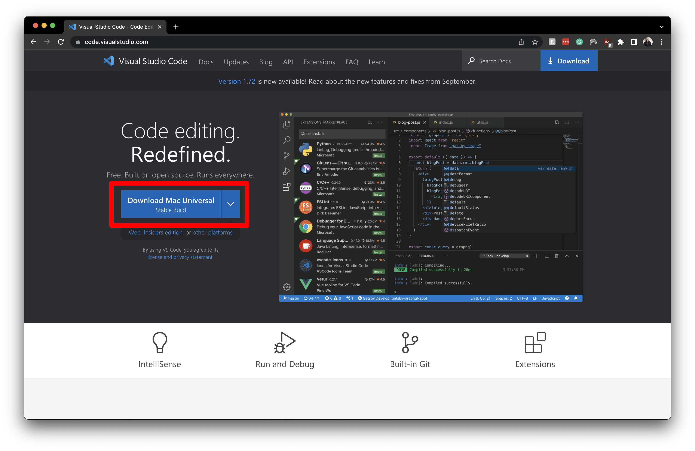
2. From there installation should install and you can go ahead and place the file on your `Desktop` for now.
   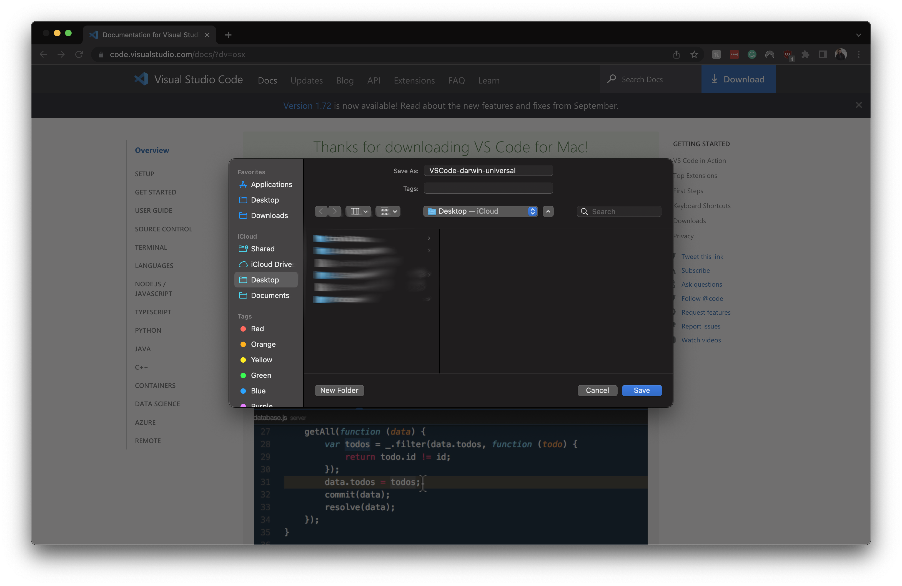
3. Once you place the file on your `Desktop` you should now have a zip file, double click on it to unzip the file, and then you should see the `VSCode` App. When you get the app open up your `Finder` and place `VSCode` in the `application` folder
   

That's it, you know have VSCode installed, I recommend once you start up VSCode, to install `code` you can do this by:

1. Press `Command + Shift + P`
   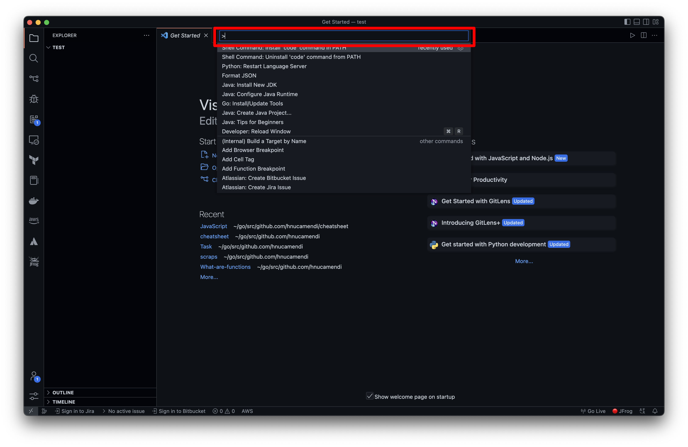
2. type in `code`
   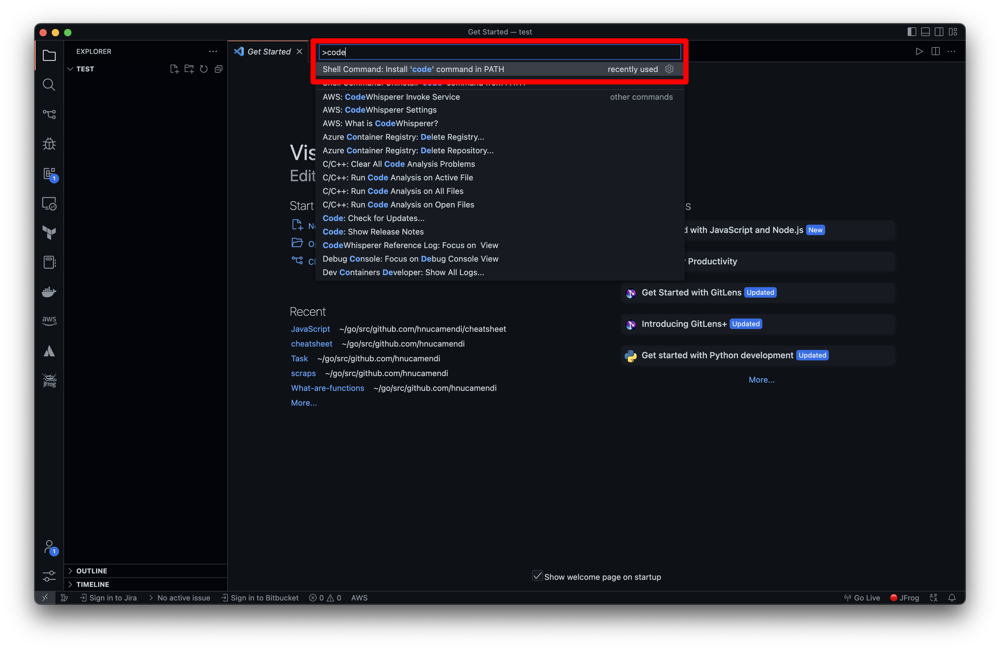
3. From here you may get a pop-up asking you to type in your password, once you type it in you should get a `successfully installed` message
4. This will allow us to open up a folder from our terminal using the `code` keyword like so
   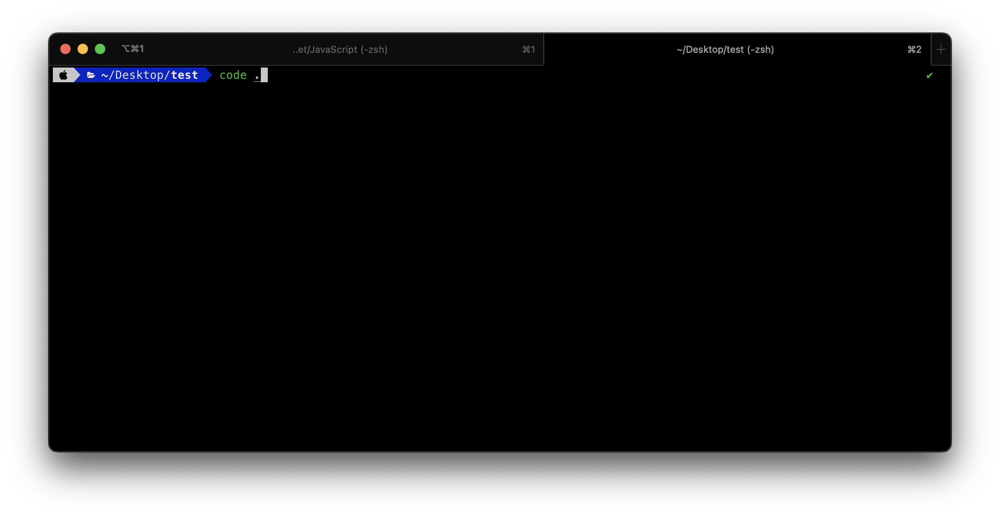
5. When running this command it opens the directory that we are in as the root in VSCode, and from here we can get started on writing some code!
   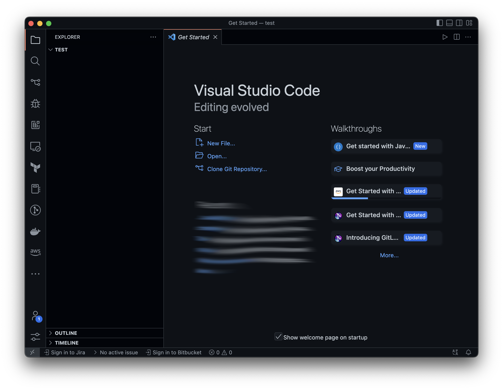

## Node | Mac

There are two installation methods, with Brew and without Brew, read over both before deciding which one you would like to use

### Without Brew

1. First go to the official [Node Webiste](https://nodejs.org/en/download/)
2. Click on the
   
3. Install the file to your desktop
   
4. from here you can follow the installation instructions from the installer

### With Brew

1. Open a terminal window
2. Run this command `Brew install node`

Done! This is why I love brew, it just takes care of the whole process

## Other | Mac

These are some tools that I would recommend installing

1. [Iterm2](https://iterm2.com/) with [oh-my-zsh](https://ohmyz.sh/) and the [powerlevel10k theme](https://github.com/romkatv/powerlevel10k)
2. [Fira Code](https://github.com/tonsky/FiraCode) with ligaments enabled this font is really nice

## VSCode | Windows

First, go to the official [VSCode Website](https://code.visualstudio.com/), and you should arrive at a screen like this (which may change in the future).

1. Once on a screen click on the `Download Mac Universal` Button
   
2. From there installation should install and you can go ahead and place the file on your `Desktop` for now.
   
3. Once you place the file on your `Desktop` you should now have an exe file, double click it and follow the installation process. When you get the app open up you are ready to go

That's it, you know have VSCode installed, unlike on mac code is already available for you to use, so you don't have to install that separately

## Node | Windows

1. First go to the official [Node Webiste](https://nodejs.org/en/download/)
2. Click on the
   
3. Install the file to your desktop
   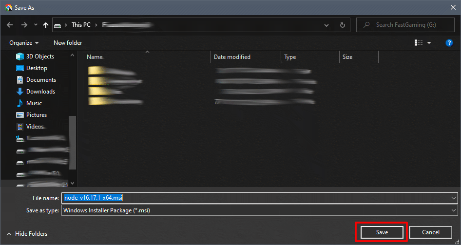
4. from here you can follow the installation instructions from the installer
   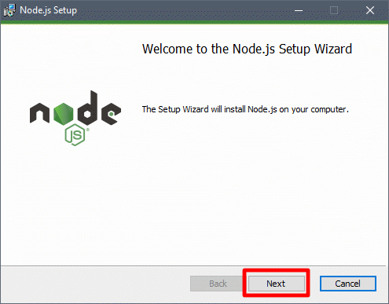
5. 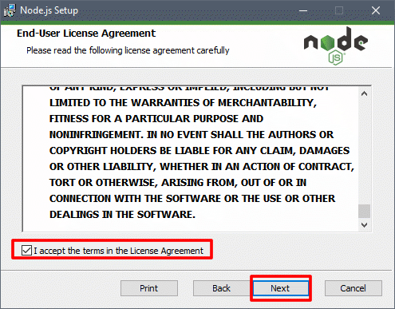
6. 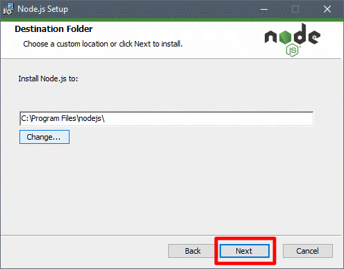
7. 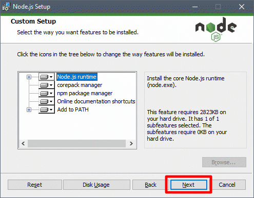
8. 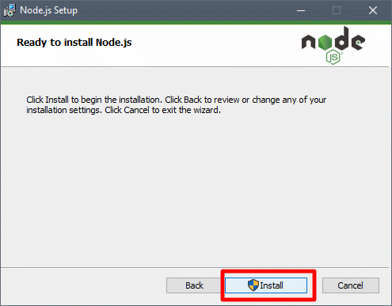

---

| <strong>[Scroll to top of section](#installation-and-configuration)</strong> |
| <strong>[Scroll to last section](#table-of-contents)</strong> |
| <strong>[Scroll to top of page](#welcome-to-javascript)</strong> |

---

# Running Programs

There are two run-time environments in JavaScript, this is something covered in detail in the [Node](#node) section, but for now, all that is really needed is to know that we can run our program:

1. In our Web Browser (Google Chrome, Safari, Firefox, etc...)
2. Or on our machines with Node

## Running in the browser

1. Ensure that you have an HTML page in the same directory where you are writing your JavaScript code. Below is the minimum code we need to get our `<script></script>` connected to our JavaScript code

```HTML
<!DOCTYPE html>
<html lang="en">
  <head>
    <meta charset="UTF-8" />
    <meta http-equiv="X-UA-Compatible" content="IE=edge" />
    <meta name="viewport" content="width=device-width, initial-scale=1.0" />
    <script src="./codeAlong.js" defer></script> <!-- This is where we link the JS code -->
    <title>Document</title>
  </head>
  <body></body>
</html>
```

2. Once we have this piece, we can write some JavaScript code, make sure the filename of the JavaScript file matches what you have in the `index.html` file. The block of code below will choose a random number on each run and print the numbers 0 up to the random number value. and print it to the console

```JavaScript
for (let i = 0; i < Math.random() * 1000; i++) {
  console.log(i);
}
```

3. Once we have our files set up you can use extensions like `live server` we install it from the `extensions` tab on the left-hand tab.
   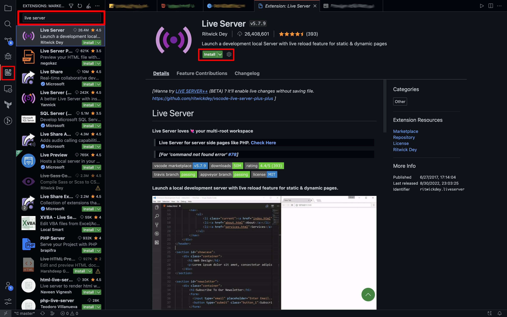
4. Once we have this installed, when you go into your HTML file you will see a button on the bottom right of your VSCode window that says `Go Live`, you should click on this, and a new window in your default browser will open.
5. Now in the Browser you can open the browser's console a couple of ways.
   1. On a keyboard with all the F1-F12 keys press `F12` to open the console
   2. On a keyboard without these keys, look for an `Fn` key, and press `Fn` + `F12` In this case F12 might be a media key or something else
   3. Right-click anywhere in the browser window and click `inspect` then in the new window click on the tab labeled `console`
      
6. Nowhere in the console we can write some code, but the code that we wrote in our JavaScript code, should already be showing up here, so as you write more code as long as you `console.log` it, it will show up here
   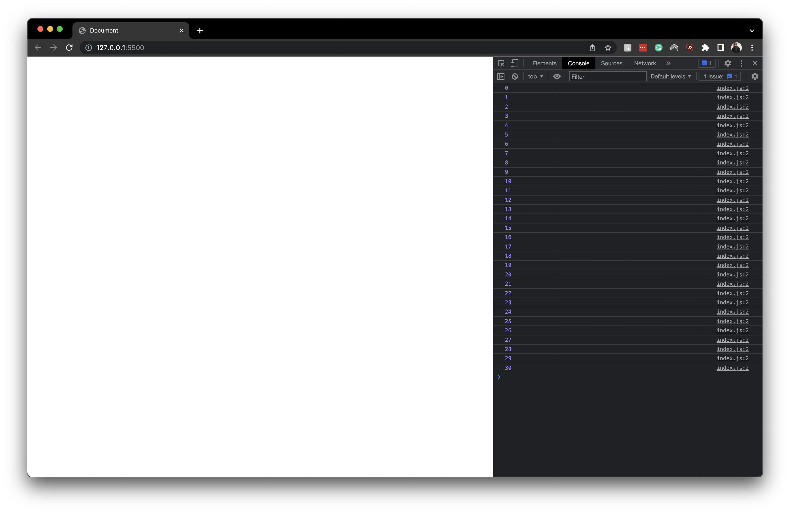

## Running in Node

To do this, you must have Node installed [Install Node | Mac](#node--mac) [Install Node | Windows](#node--win)

1. With Node running our program is much simpler, we don't need an HTML file for this, all we need is a JavaScript file with our code

```JavaScript
for (let i = 0; i < Math.random() * 1000; i++) {
  console.log(i);
}
```

2. Now open up a terminal window, you can do this in VScode by pressing `control` + `shift` + `\``
3. make sure you are in the directory that holds your code
4. run the command: `node {{name of JS file}}` In my case let's say the name of my file is `index.js` I would run `node index.js`. And this is it! as long as you have something being logged to the console with `console.log` you will see a result in the terminal window
   

---

| <strong>[Scroll to top of section](#running-programs)</strong> |
| <strong>[Scroll to last section](#installation-and-configuration)</strong> |
| <strong>[Scroll to top of page](#welcome-to-javascript)</strong> |

---

# Hello World Program

JavaScript does not require any boilerplate, or any previous configuration to get started. In our `Hello World` program, we use `console.log()` to print something to the console, in this case, a string that says `"Hello World"`. You may be asking, what is the console? and why `console.log`? `console` is an object with a lot of methods that can do many things to/on the console object; one of them being the `log` method which prints and displays something to the console.

```JavaScript
console.log("Hello World");
```

What happens if we print the console object to the console? Short answer: we get to see all the possible methods we can call on the console. For the long answer, we can go ahead and do just that. Here is the result from this code: `console.log(console)`:

```JavaScript
Object [console] { // Here we can see that indeed console is an object
  log: [Function: log], // Here we see the log method that we have been using. And we can see that indeed it is a method(function)
  warn: [Function: warn],
  dir: [Function: dir],
  time: [Function: time],
  timeEnd: [Function: timeEnd],
  timeLog: [Function: timeLog],
  trace: [Function: trace],
  assert: [Function: assert],
  clear: [Function: clear],
  count: [Function: count],
  countReset: [Function: countReset],
  group: [Function: group],
  groupEnd: [Function: groupEnd],
  table: [Function: table],
  debug: [Function: debug],
  info: [Function: info],
  dirxml: [Function: dirxml],
  error: [Function: error],
  groupCollapsed: [Function: groupCollapsed],
  Console: [Function: Console],
  profile: [Function: profile],
  profileEnd: [Function: profileEnd],
  timeStamp: [Function: timeStamp],
  context: [Function: context]
}
```

Hopefully, this gives some insight into how JavaScript works, we can see that there are pre-defined objects that we can call methods to execute tasks; This makes writing code a lot easier since we don't have to define all of this functionality ourselves. Now I'll summarize the important things we covered in this first block of code:

---

| <strong>[Scroll to top of section](#hello-world-program)</strong> |
| <strong>[Scroll to last section](#running-programs)</strong> |
| <strong>[Scroll to top of page](#welcome-to-javascript)</strong> |

---

# JavaScript Best Practices

## JavaScript Typing

In coding languages we use primitive types which are immutable; meaning they are not able to be changed, and objects which are not considered primitive.

We use primitive types and data structures together to build some complex logic.

Primitive Types:

```JavaScript
const a = "String" // String
const b = 123 // Number
const c = 12.23 // Also a Number type
const d = true // Boolean
const e = false // other Boolean value
const f = null // Null
const g = undefined // Undefined
```

## Naming Variables

In JavaScript we use `Camel Casing` for most variable naming:

1. No spaces
2. The first word is lowercase and each word following that begins with an uppercase letter

```JavaScript
const fullName = "Jane Doe";
const age = 31;
const isTrue = true;
const generatePassword = function(){...};
const anotherFunction = () => {...};
function oneMoreFunction(){...};
```

## Naming Classes

Other than camel casing we use `Pascal Casing` specifically for classes:

1. No spaces
2. Every word in the variable name starts with a capital letter

```JavaScript
class Car {...}
class AnotherClass {...}
class OneMoreClass {...}
class LongerClassName {...}
```

## Other Naming Rules

Here are some general rules to follow when creating variable names in JavaScript. We don't have to follow these rules, but each language has its own set of agreed-upon standards to make it easier for JavaScript developers to understand each other's code.

1. Keep names short
2. Write descriptive names
3. When initializing functions it's good practice to write a special kind of comment that describes the function. Below are two examples.

this special comment is helpful because it allows developers to read at a glance what a function is for, and if it has any parameters, what they represent.

```JavaScript
/**
 * Prints the string "Hello World" to the console
 */
function helloWorld() {
  console.log("Hello World");
}
```

```JavaScript
/**
 * @Property {Function} helloUser Prints a welcome string
 * @Param {string} name Your name
 * @returns {void}
 */
function helloUser(name) {
  console.log("my name is " + name);
}
```

When we describe a function with this special comment we can hover over the function and get a code snippet like the image below:

allows us to at a glance understand what a function is for, this comes in very handy with more complex functions, or when learning to use a new framework

## Abstraction

Abstraction

---

| <strong>[Scroll to top of section](#javascript-best-practices)</strong> |
| <strong>[Scroll to last section](#hello-world-program)</strong> |
| <strong>[Scroll to top of page](#welcome-to-javascript)</strong> |

---

# Node

Node is the solution to writing JavaScript in the backend(servers). When JavaScript was created JavaScript by itself was not able to run on a server, unless we used frameworks or other workarounds to achieve this. So Node was created to fix this.

Node is not another language, it is still JavaScript, it is also not a framework, Node is a `run-time environment`. At a high level, we can think of a run-time environment as the place where the code executes.

## Run-Time Environment(RTE)

1. The Browser (Google Chrome, Firefox, Safari)
2. Node.JS

When running code in the Browser:

- Code does not have access to resources on our machine
- Does Has access to the Document Object Model(DOM)
- Code is tied to the <script> tag

When Running Code in Node:

- Code does access our machine's resources
- Does not have access to resources on our machine
- Code can be run in the terminal

## Modules in Node

Code that is packaged up and ready to be imported into any project by the developer as needed. Popular modules include:

- HTTP and HTTPS (for web servers)
- FS (for file reading and writing)
- OS (for interaction with the operating system)

But there are many more and commonly we find them in package managers like Node Package Manager [NPM](https://www.npmjs.com/).
Also, any code that we write in Node can be imported and exported as a module throughout our code, to create an abstraction, and separate our concerns in code.

## Event-Driven Programming


1. EventEmitter: The Event Emitter is the module that allows objects to communicate using. As the name implies an emitter will emit or send a signal for something to be done, for an emitter to send a signal, there is usually something happening in our program that triggers it like clicking on a button. When this happens a listener function that has been defined to listen to this specific signal from our emitter will catch the signal and execute some code.
2. Events: Events can be many things, on web applications it could be hovering over a section on a website, clicking a button, submitting a form, dragging an item, and many other things. An event is something that the user can do on a website, and that is many things
3. Event Loop: When an event is triggered it's like the green light for them to go through the event loop and find the function that corresponds to the event. Remember that each event that gets emitted corresponds to a specific listener that can act upon that event. We will cover the Event loop in more detail in the next slide.
4. Event Handler: The event handler is a function that we define to listen to certain events, this function should provide some logic so that when it listens and finds the event it is looking for, it does an action, like sending data to a Database, redirect traffic to another page, change the state of the program or simply log something to the console. Like the name implies the function we define here should handle the event that it receives.

## The Event Loop


Remember this is a closer look at the event loop from the last step.

1. Requests going in: Requests coming are from when events are triggered, remember this can happen when a user clicks on a button or performs some other action that has an event emitter attached
2. Event Queue: JavaScript is single-threaded, meaning that by default it can only perform one action at a time. But remember when we use nod we are using the Node run-time, and in the node run-time we can run code asynchronously. The event queue, as the name implies is a queue that holds a list of all the pending events that have been triggered that are waiting to find their listener function and execute a task. This model is known as the non-blocking model.
3. Event Loop: When we have an event in the queue Node will get the oldest event that is the oldest first, and put it through the event loop, then the second oldest, etc... The event loop is an endless loop that waits for tasks to execute and then sleeps until it gets a new task to execute. That is the event loop simplified, it has steps in it that perform specific tasks at specific times, but that is a bit out of scope for this introduction to Node.
4. Thread Pool: Not all events can be executed in one execution, some functionality completes a task properly that is taken care of in the event loop, but what we need to know now is that the thread loop is responsible for assigning CPU threads to events being executed in the event loop as needed. Remember how I mentioned the Node run-time has access to our machine resources? This is part of that, when we run a program using Node, it manages how our program interacts with the physical processing equipment in our computers.
5. Operation Completed: Once an event is executed by the event loop, we can free up some space in our call stack(a list of events taking up threads) and return the event finished to the event emitter that started this sequence of events.
6. Request going out: So following the task returning the request that was sent to be processed will now return an error if it errored, or return whatever value was expected when the process started

---

| <strong>[Scroll to top of section](#node)</strong> |
| <strong>[Scroll to last section](#javascript-best-practices)</strong> |
| <strong>[Scroll to top of page](#welcome-to-javascript)</strong> |

---

# Functions. What are they?

Simply put a function in programming is like a container full of instructions. We can reuse this container and not have to worry about writing the instructions again and again. Since they are already in our function.

## Declaring a Function

Most languages have a concept of a function, JavaScript has some functions resembling functions from languages like C++ or Java, and it has special functions that are somewhat unique to JavaScript.

Note:

- although the syntax here may look like the one from C++ or Java, under the hood, they function very differently.
- Note about Functions in JavaScript: Functions can be assigned to variables, this is essential to understanding how to declare the [Arrow Function](#The-Arrow-Function) and the [Classic Non-Hoisted Function](#The-Classic-Non-Hoisted-Function)

## The Classic Hoisted Function

Check out how to call this type of Function [Here](#Invoking-Classic-Hoisted-Function)

```JavaScript
function helloWorld(){
  return "Hello World from a Hoisted Function"
}
```

## The Classic Non-Hoisted Function

Check out how to call this type of Function [Here](#Invoking-Classic-Non-Hoisted-Function)

```JavaScript
const helloWorld = function(){
  return "Hello World from a non-hoisted function"
}
```

## The Arrow Function

Check out how to call this type of Function [Here](#Invoking-Arrow-Function)

```JavaScript
const helloWorld = () => {
return "Hello World from an arrow function"
}
```

[Why are there so many ways to declare a function!](#why-are-there-so-many-ways-to-declare-a-function)

## Invoking a Function

A general key to invoking a function is that if a function is Hoisted, then it can be called before it is defined. Otherwise, it must be called after the function definition [How to Define a Function](#delcaring-a-function). This section will show all the `valid` ways of invoking functions in JavaScript.

## Invoking Classic Hoisted Function

As you can see, hopefully, this describes what it means for a function to be Hoisted, the function declaration will always be read first, and because of this we can call the function before we declare it or after

```JavaScript
//Defining the function
function helloWorld(){
  return "Hello World from a Hoisted Function"
}

// Invoking the function after the declaration
helloWorld() // returns "Hello World from a Hoisted Function"
```

```JavaScript
// Invoking the function before the declaration
helloWorld() // returns "Hello World from a Hoisted Function"

//Defining the function
function helloWorld(){
  return "Hello World from a Hoisted Function"
}
```

## Invoking Classic Non-Hoisted Function

```JavaScript
//Defining the function
const helloWorld = function(){
return "Hello World from a Hoisted Function"
}

// Invoking the function after the declaration
helloWorld() // returns "Hello World from a non-hoisted function"
```

## Invoking Arrow Function

```JavaScript
//Defining the function
const helloWorld = () => {
return "Hello World from an Arrow Function"
}

// Invoking the function after the declaration
helloWorld() // returns "Hello World from an Arrow Function"
```

## Declaring and Invoking Factory Functions

Factory functions are functions that return objects, simple, it works kind of like a `class` but remember there are many ways to accomplish the same thing in JavaScript. A factory function is really defined by what is returned so it can be hoisted, non-hoisted, or arrow function.

```JavaScript
function person(firstName, lastName, age, job) {
  return {
    firstName: firstName,
    lastName: lastName,
    age: age,
    job: job,
  };
}

const p = person("John", "Doe", 34, "worker");

console.log(p); // Returns { firstName: 'John', lastName: 'Doe', age: 34, job: 'worker' }
```

In practice you probably won't encounter factory functions, classes and constructors are preferred, but it's good to know this is possible.s

## Declaring and Invoking Anonymous Functions

Usually, we don't create Anonymous Functions by themselves, so I will make a special section here to talk all about anonymous functions

```JavaScript
// Classic hoisted function with an anonymous function
function add(a) {
  return function (b) {// This is the anonymous function => notice it has no variable name
    return a + b;
  };
}

//Invoking this function
console.log(add(1)(2)); //Returns 3
```

```JavaScript
// Classic Non-Hoisted with an anonymous function
const add = function (a) {
  return function (b) { // This is the anonymous function => Notice its very similar to the example above
    return a + b;
  };
};

console.log(add(4)(3)); //Returns 7
```

```JavaScript
const add = (a) => {
  return (b) => { // This is the Anonymous function
    return a + b;
  };
};

console.log(add(3)(4)); //Returns 7

// The Cool thing about Arrow Functions is they are used to write Functions in shorthand like below

const add = (a) => (b) => a + b; // The `(b) =>` is the anonymous function
//This is called a one liner and its a very modern way of writing JS

console.log(add(3)(3)); // Returns 6
```

## Using Arguments and Parameters

```JavaScript
// Classic Hoisted Function with Parameters and Arguments
function sayHello(name) {
  return 'Hello ' + name;
}

console.log(sayHello('Osiel')); //Returns "Hello Osiel"
```

```JavaScript
// Classic Non-Hoisted Function with Parameters and Arguments
const sayHello = function(name) {
  return 'Hello ' + name;
}

console.log(sayHello('Harold')); //Returns "Hello Harold"
```

```JavaScript
// Arrow Function with Parameters and Arguments
const sayHello = (name) => {
  return 'Hello ' + name;
}

console.log(sayHello('Samny')); //Returns "Hello Samny"

// The shorthand would be like so:
const sayHello = (name) => 'Hello ' + name;
```

## Functions Code Along

[Click Here](./code-along/functions/functions.js)

---

| <strong>[Scroll to top of section](#functions-what-are-they)</strong> |
| <strong>[Scroll to last section](#node)</strong> |
| <strong>[Scroll to top of page](#welcome-to-javascript)</strong> |

---

# Control Flow

The order in which individual statements, instructions, or function calls are executed. When we define control flow in our code the Lexical Scope can change as the program runs.

## Procedural Execution

The default, procedural execution is when the code of a program is read from the top down in order

```JavaScript
console.log("Hello")
console.log("World")
console.log("How")
console.log("Are")
console.log("You?")
```

Returns:

```JavaScript
// Hello
// World
// How
// Are
// You?
```


You can see that the code prints out the values in the order that they are listed from top to bottom. `Hello, World, How, Are, You?`. In the same example, I want to show what happens when we declare a function.

```JavaScript
const name = "John";

function printGreeting(greeting) {
  console.log(greeting);
}

printGreeting("Hello!")s
console.log(john)
```


When we declare a function in the middle of our code, we `skip` the `function declaration` until we `call` or `invoke` the function. So this execution will actually

1. Declare the function first(although not something that we can see in the GIF)
2. Create a variable `firstName` and assign it the value `John`
3. Move to line 9 where we `call` / `invoke` the function
4. It goes back up to the function body
5. Returns the `console.log()` back at line 9
6. Then we move on to line 10.

It's a common mistake, but it's important to remember that a function declaration when [Hoisted](#the-classic-hoisted-function) will be created before anything else, and be skipped until the function is called or invoked. When a function is not [Non-Hoisted](#the-classic-non-hoisted-function) or [Arrow Function](#the-arrow-function) it will be declared in the order everything else, procedurally.

```JavaScript
console.log("Hello from the outside");

if (2 < 3) {
  console.log("Hello, 2 is less than 3");
}

if (2 > 3) {
  console.log("2 is greater than 3");
} else {
  console.log("2 will never be greater than 3!");
}

console.log("ok bye");
```

## Conditional Execution


When we use conditionals in our code we can alter the way our code executes drastically, the example here is small and simple but often we can use conditionals to run whole blocks of code that return something and exit the code, from within the condition.

1. Start at the top and by default run code from top to bottom, so `Hello from the outside` will be printed
2. Our first condition, if `2 < 3` then and only then, we print `Hello, 2 is less than 3` otherwise we just skip this code entirely
3. Our second condition, if `2 > 3` then and only then, we print `2 is greater than 3` but we know this can never be true, so we skip this block and go to the `else` statement, `else` is not another option, its the option that is executed when nothing before it returned true, so we will print `2 will never be greater than 3!`
4. End by printing `ok bye`

## Anatomy of a Conditional

There are two types of conditionals, the `if else` block and the `switch statement`

## If-Else Block

```JavaScript
if (condition) { // Conditions must return, or be of boolean type
  // Do something
}else {
  // Do this only if all the above return false
}
```

As we have seen before here is a simple if-else block

```JavaScript
if(2 < 3 ) { // results to a boolean value True, because 2 is less than 3
  console.log("This is true");
}else {
  console.log("This is false")
}
```

The example above is very simple and will always return true => `This is true`, let's write a more realistic example

```JavaScript
const namesInHat = ["Osiel", "Justin", "Tias", "Faith"];

const randomNumber = Math.floor(Math.random() * namesInHat.length + 1);

if (randomNumber === 3) { // === is a strict equality checker, checks if two values are the same type and value
  console.log(namesInHat[randomNumber]);
} else if (randomNumber === 0) {
  console.log(namesInHat[randomNumber]);
} else if (randomNumber === 1) {
  console.log(namesInHat[randomNumber]);
} else if (randomNumber === 2) {
  console.log(namesInHat[randomNumber]);
}else {
  console.log("None of those match my list, try again")
}
```

Ok, maybe this isn't the most realistic example, since there are better more efficient ways to make a random hat name picker. But in this example, we get to set our top `if` condition, our `else if` conditions, similar to the else block they run:

1. only if the previous condition is false
2. and are attached to the original if the condition

and then we set our `else` block in the case that we pull a number that does not exist in our array.

One more thing about if blocks

## the condensed block

```JavaScript
if (2 < 3) console.log("this is true")
```

This works best for cases where you want to quickly check if something is true, without writing a whole block, but as you see, you cannot explicitly declare and `else` or `else-if` block

## Switch Statement

```JavaScript
switch (case) { // A value that we will later use to compare against in our cases
  case condition: // a case is like an if or else-if block, and the condition is the thing we are comparing against
  //Do something
  break; // The break keyword moves the execution along in the case that a value is true
  default: // same as the else block
  // Do this only if all the above return false
}
```

Here is a simple example using a switch statement:

```JavaScript
switch (2) { // We will compare other values against this
  case 3: // => is 2 === 3 ? No
    console.log("not equal");
    break;
  case 2: // => is 2 === 2 ? Yes
    console.log("Equal"); // Print this
    break; // Break out of this block and return to normal execution
  default:
    console.log("Non were equal");
}
```

We can see switch statements are smaller, and a bit easier to read. We mostly use them for occasions where we have a lot of conditions to compare, instead of having large blocks for each, we instead write cases under a switch statement. Now let's write the realistic example from before using a switch statement

```JavaScript
const namesInHat = ["Osiel", "Justin", "Tias", "Faith"];

const randomNumber = Math.floor(Math.random() * namesInHat.length + 1);


switch (randomNumber) {
  case 3:
    console.log(namesInHat[randomNumber]);
    break;
  case 0:
    console.log(namesInHat[randomNumber]);
    break;
  case 1:
    console.log(namesInHat[randomNumber]);
    break;
  case 2:
    console.log(namesInHat[randomNumber]);
    break;
  default:
    console.log("None of those match my list, try again")
}
```

Much more condensed code, with the same functionality

## Truthy Falsey

Truthy Falsey values are the name we give to how a conditional will determine if a value in the condition statement is true or false. A lot of time when learning about truthy falsey we start also learning about these operators:

```JavaScript
|| // Or
&& // And
! // Not (also known as the "bang" symbol)
?? // Null Coalescing
.? // Optional Chaining
=== // Strict equality operator
== // Non-Strict equality operator
```

Here are some quick examples of how they work before we define Truthy Falsey:

```JavaScript
if (2 < 3 || 2 > 4) console.log("This is true") // Because the || operator only checks if 1 condition is true
if (2 < 3 && 2 > 4) console.log("This is false") // Because the && operator needs both conditions to return true
if (2 == 2 && 2 == "2") console.log("This is True") // Because the == operator only check the value, not the typing
if (2 === 2 && 2 === "2") console.log("This is False") // Because the === operator checks the value and typing
```

Now to dive deeper into how JavaScript determines this, we need to describe item precedence, very similar to how the order of operations works in math

This code snippet is from here: [MDN Web Docs](https://developer.mozilla.org/en-US/docs/Web/JavaScript/Reference/Operators/Operator_Precedence)

```JavaScript
a || (b * c); // evaluate `a` first, then produce `a` if `a` is "truthy"
a && (b < c); // evaluate `a` first, then produce `a` if `a` is "falsy"
a ?? (b || c); // evaluate `a` first, then produce `a` if `a` is not `null` and not `undefined`
a?.b.c; // evaluate `a` first, then produce `undefined` if `a` is `null` or `undefined`
```

The way to read this is like so:

1. The || operator looks to the left first, if this value is true it won't look to the right, it will return True
2. The && operator will look to the left first, and if it is false it will return false, ignoring what's on the right, if the first value on the left is true, it will look at the value on the right, and only that is true will it return true
3. the ?? operator will see check if the value on the left is `null` or `undefined` first, if so it will return the value on the right. If not then it will check if the value on the right is `null` or `undefined` and return the value on the left.
4. The ?. will look to the left first, if a is anything other than `null` or `undefined` it will check if b is true, and so on.

Here is a link with a table describing the precedence of each operator [MDN Web Docs](https://developer.mozilla.org/en-US/docs/Web/JavaScript/Reference/Operators/Operator_Precedence#table)

## Short Circuiting

We have already explored the concept of short-circuiting, we can think of it as something happening that makes an action
jump out of its standard execution. Example:

For the ||(OR) operator our variable `a` is short-circuiting. Because the || operator expects one of the two values to be true to return that value. Once it checks the left, the program has no need to check the right, so it just stops and checks the value on the left

```JavaScript
const a = true || "Hello";
const b = false || "Hello";

console.log(a); // returns true
console.log(b); // returns "Hello"
```

For the &&(AND) operator our variable `c` is short-circuiting. Because the && operator expects both values to be true. Once it checks the left, it has no need to check the right, so it just stops and returns the value on the left.

```JavaScript
const c = false && "";
const d = true && "Hello";

console.log(c); // Returns false
console.log(d); // Returns "Hello"
```

## Control Flow Code Along

[Click Here](./code-along/control-flow/control-flow.js)

---

| <strong>[Scroll to top of section](#control-flow)</strong> |
| <strong>[Scroll to last section](#functions-what-are-they)</strong> |
| <strong>[Scroll to top of page](#welcome-to-javascript)</strong> |

---

# Objects

Objects in JavaScript hold a collection of properties, we define our properties in objects in `key pair` values. The key is the identifier, and the value is the property value. We can add primitive variables, functions, or other objects as valid properties. When we define a function inside of a method, we call that a Method, instead of a Function.

## Defining an Object

There are two ways that we can instantiate an object

```JavaScript
const car = new Object() // using the 'new' keyword
const car = {...} // using {} curly brackets
```

When using the `new` keyword we can still attach properties to the object like so:

```JavaScript
const car = new Object();
car.carName = "fun car";
// Anonymous function
car.someMethod = function () {
  return "Hello World";
};
// Named Function
car.someOtherMethod = function someOtherMethod() {
  return "Hello Earth";
};

console.log(car);
// Prints the object below
// {
//   carName: 'fun car',
//   someMethod: [Function (anonymous)],
//   someOtherMethod: [Function: someOtherMethod]
// }
```

We can define the same object by using {} curly brackets to initialize the object like so:

```JavaScript
const car = {
  carName: "fun car",
  someMethod: function () {
    return "Hello World";
  },
  someOtherMethod: function () {
    return "Hello Earth";
  },
};

console.log(car);
// Prints the object below
// {
//   carName: 'fun car',
//   someMethod: [Function: someMethod],
//   someOtherMethod: [Function: someOtherMethod]
// }
```

We can think of objects as a way to describe items, in a list of values, just like if we made a list of something. For example, a car would have a color, make, model, and some other properties, we can define those using an object

```JavaScript
const car = {
  color: "red",
  make: "Honda",
  model: "Civic",
};
```

Once we define an object we can reference the items inside the object

```JavaScript
const car = {
  color: "red",
  make: "Honda",
  model: "Civic",
};

console.log(car.color); // Returns "red"
console.log(car["model"]); // Returns "Civic"
```

## What can Objects hold?

Objects in JavaScript can hold all types of values, even other objects. Below I made a car object with multiple methods, variable types, and objects. Take some time to read through it and understand what is going on, there is some syntax that has not been covered.

```JavaScript
const car = {
  carName: "fast nd furious",
  color: "red",
  make: "Honda",
  model: "Civic",
  miles: 0,
  distanceToWork: 0,
  gasTank: 100,
  musicInCar: ["Royalty free playlist"],
  trashUnderSeats: {
    leftSeat: ["gum", "stickers"],
    rightSeat: ["winter glove", "cheese"],
  },
  addMusic: function (music) {
    this.musicInCar.push(music);
  },
  getMusic: function () {
    return this.musicInCar;
  },
  setDistance: function (value) {
    this.distanceToWork = value;
  },
  getDistance: function () {
    return this.distanceToWork;
  },
  driveToWork: function () {
    this.gasTank -= this.distanceToWork;
    return `Drove ${this.distanceToWork} miles, and now ${this.carName} has ${
      this.miles + this.distanceToWork
    } miles`;
  },
  canIGetToWork: function () {
    if (this.gasTank > this.distanceToWork) return "Yes, you can drive to work";
    return "No, you can't drive to work";
  },
  getGasTank: function () {
    return this.gasTank;
  },
};

console.log(car.getGasTank()); // Returns 100
console.log(car.getDistance()); // Returns 0
car.setDistance(12);
console.log(car.getDistance()); // Returns 12
console.log(car.driveToWork()); // Returns 'Drove 12 miles, and now fast nd furious has 12 miles'
console.log(car.canIGetToWork()); // Returns 'Yes, you can drive to work'
console.log(car.getMusic()); // Returns [ 'Royalty free playlist' ]
car.addMusic("Birthday Song");
console.log(car.getMusic()); // Returns [ 'Royalty free playlist', 'Birthday Song' ]
console.log(car.color); // Returns 'red'
console.log(car["model"]); // Returns 'Civic'
console.log(car.getGasTank()); // Returns 88
```

Quite an extensive example, hopefully, you took some time to fully go over the code and understand it, a quick note on objects though. Imagine if anytime we wanted to make a new car we would have to write <b>EVERY</b> `method`, `variable`, `object`, `array`, and anything else that your car might have. It would be impossible to make enough cars for the whole world without making mistakes. That is why we have classes! Spoiler alert Classes are the blueprints to create objects, and there is a section that describes all about how classes work [Here](#classes).

## Object Destructuring

Let's use this pretty big object as an example, imagine if we wanted to print the `color` to the `console` but only the color, and we have no need at all for the rest of the object. This may not be realistic in this example but situations like these are common. We can use Destructuring to break apart an object and get ONLY the property or properties that we need.

```JavaScript
const car = {
  carName: "fast nd furious",
  color: "red",
  make: "Honda",
  model: "Civic",
  miles: 0,
  distanceToWork: 0,
  gasTank: 100,
  musicInCar: ["Royalty free playlist"],
  trashUnderSeats: {
    leftSeat: ["gum", "stickers"],
    rightSeat: ["winter glove", "cheese"],
  },
  addMusic: function (music) {
    this.musicInCar.push(music);
  },
  getMusic: function () {
    return this.musicInCar;
  },
  setDistance: function (value) {
    this.distanceToWork = value;
  },
  getDistance: function () {
    return this.distanceToWork;
  },
  driveToWork: function () {
    this.gasTank -= this.distanceToWork;
    return `Drove ${this.distanceToWork} miles, and now ${this.carName} has ${
      this.miles + this.distanceToWork
    } miles`;
  },
  canIGetToWork: function () {
    if (this.gasTank > this.distanceToWork) return "Yes, you can drive to work";
    return "No, you can't drive to work";
  },
  getGasTank: function () {
    return this.gasTank;
  },
};

const { color } = car // Returns "red"
```

The way we read this is:
`initialize a color variable, get the value of color from the car object, and put it in this new color variable`. For this to work the `color` variable must be a variable that exists in the object

this is the syntax that we call destructuring, it has the same functionality as this syntax:

```JavaScript
const color = car.color
```

Here is another example, in this example, we rename the variables after destructuring them

```JavaScript
const testObj = {
  date: "2001-06-02",
  data: {
    name: "John",
    age: 32,
  },
};

const { date: d } = testObj;
const { data: info } = testObj;

console.log(d); // Returns "2001-06-02"
console.log(info); // Returns { name: "John", age: 32 }
console.log(info.name); // Returns "John"
console.log(info.age); // Returns 32
```

## Objects Code Along

[Click Here](./code-along/objects/objects.js)

| <strong>[Scroll to top of section](#objects)</strong> |
| <strong>[Scroll to last section](#control-flow)</strong> |
| <strong>[Scroll to top of page](#welcome-to-javascript)</strong> |

---

# Arrays

our last section on objects covered how we can make some items that can hold various properties organized by key pair values. And a perfect example of an object is Arrays. Arrays are just an object that is pre-defined for us to use in JavaScript, meaning that arrays have methods

## Defining an Array

```JavaScript
const a = [] // Empty array
const b = new Array() // Empty Array using 'new' keyword
```

Very similar to how we can initialize objects, part of the reason is that Arrays are objects! Similar to how we can add values to objects, when we use the `new` keyword, this is how we work with arrays:

```JavaScript
const names = new Array();

names[0] = "Osiel";
names[1] = function someMethod() {
  return "Hello World";
};
names[2] = () => "Hello World";
names[3] = true;
names[4] = { valueInObject: "cool value" };

console.log(names);
// Prints the array below
// [
//   'Osiel',
//   [Function: someMethod],
//   [Function (anonymous)],
//   true,
//   { valueInObject: 'cool value' }
// ]
```

We will talk about the `names[0]` syntax soon, but we are choosing the index in which to place our values into. we can also create arrays with [] square brackets, here is the same array initialized that way:

```JavaScript
const names = [
  "Osiel",
  function someMethod() {
    return "Hello World";
  },
  () => "Hello World",
  true,
  { valueInObject: "cool value" },
];

console.log(names);
// Prints the array below
// [
//   'Osiel',
//   [Function: someMethod],
//   [Function (anonymous)],
//   true,
//   { valueInObject: 'cool value' }
// ]
```

## Arrays and their Index


Here we have an array with the values:

```JavaScript
const arr = [24, 12, 10, 9, 15, -4]
```

The index represents the location in the array where the values are. And we can't count each value starting from `1` but we start counting the index of values from `0`.

To get a value we must reference the location that value is in (The index of the value) so if we wanted to get the first value, we want to reference index 0.

```JavaScript
console.log(arr[0]); // Prints 24
console.log(arr[1]); // Prints 12
console.log(arr[2]); // Prints 10
console.log(arr[3]); // Prints 9
console.log(arr[4]); // Prints 15
console.log(arr[5]); // Prints -4
```

So if we use the index to reference the values in an array, there will always be 1 less numeric value than the length of the array. in our example `[24, 12, 10, 9, 15, -4]` our array has `6` values, so the max index is `5`. we can represent this in code like this:

```JavaScript
arr.length // get the number of values in the array
arr.length - 1 // to get the index value

console.log(arr[arr.length - 1]) // Prints -4
```

## Array Methods

Like in our example above, we used the `length` method to get the size of the array(number of values) there are many other methods that we can call on arrays to manipulate data in the array.

We can always get the list of methods attached to an array like so:

```JavaScript
console.log(Object.getOwnPropertyNames(Array));
// Returns:
[
  "length",
  "constructor",
  "concat",
  "copyWithin",
  "fill",
  "find",
  "findIndex",
  "lastIndexOf",
  "pop",
  "push",
  "reverse",
  "shift",
  "unshift",
  "slice",
  "sort",
  "splice",
  "includes",
  "indexOf",
  "join",
  "keys",
  "entries",
  "values",
  "forEach",
  "filter",
  "flat",
  "flatMap",
  "map",
  "every",
  "some",
  "reduce",
  "reduceRight",
  "toLocaleString",
  "toString",
  "at",
  "findLast",
  "findLastIndex",
];
```

These methods are useful because it allows us to write less code, and get a lot done. But since we are writing less code and using a predefined method, using too many methods creates a lot of abstraction. Sometimes this can be bad for beginner programmers. Abstraction is covered [here](#abstraction)

## Array Destructuring

The functionality of destructuring arrays is exactly the same as it is for objects. The only difference is the syntax we use for arrays.

Say we have an array of names mixed in with some numbers

```JavaScript
const names = ["John", "Jane", 432, 592];

const [name, [letter1, letter2], ...numbers] = names;

console.log(name); // Returns "John"
console.log(letter1); // Returns "J"
console.log(letter2); // Returns "a"
console.log(numbers); // Returns [432, 592]
```

As you can see each index that we destructure is tied to match the index from the original array, and we can nest destructuring to get individual values of an item like we did to get the first two letters of the second item in our `names` array

We can also create default values, in the case that the value that we are destructing in the original array is undefined or null, it will use the default value.

```JavaScript
const test = ["James"];

const [name = "John"] = test;

console.log(jName);
```

## Arrays Code Along

[Click Here](./code-along/arrays/arrays.js)

| <strong>[Scroll to top of section](#arrays)</strong> |
| <strong>[Scroll to last section](#objects)</strong> |
| <strong>[Scroll to top of page](#welcome-to-javascript)</strong> |

---

# Classes

Classes are our blueprint for creating objects.

## Class Definition

Common / Classic way of Defining a Class

```JavaScript
class ExampleClass {}
```

## Class Expression

Another way that we can define a Class

```JavaScript
// unnamed
const UnnamedSquare = class {};
console.log(UnnamedSquare.name); // Returns UnnamedSquare

// named
const Square = class NamedSquare {};
console.log(Square.name); // Returns NamedSquare
```

## Using a Constructor

Defining the class is only the equivalent of getting out blank blueprint paper, but how do we begin to write out and define the objects our class will create? One thing we can use to define the values we expect upon creation of our objects (what parts are needed when we create each object) to do this we use a constructor

```JavaScript
class ExampleClass {
  constructor(name, age){ // Constructors don't always have to have any parameters
    this.name = name;
    this.age = age;
  }
}
```

In this example we:

1. Define our class
2. write out our constructor `constructor(){}`
3. place two parameters in our constructor `constructor(name, age){}`
4. then we use the `this` keyword to create a variable local to the class scope `this.name` = to the argument passed in by the user `name`

An example of us using this and creating an instance(object) based on this blueprint(class) would be like this below:

```JavaScript
class ExampleClass {
  constructor(name, age){ // Constructors don't always have to have any parameters
    this.name = name;
    this.age = age;
  }
}

const test = new ExampleClass("John", 34);

// Now just like an object we can print variables from our instance using The . operator
console.log(test.name) // Prints "John"
console.log(test.age) // Prints 34
```

## Writing out a Car Class

our car will take in 3 arguments, `color`, `make`, and `model`. Then we will have a method that prints those values out to the console.

```JavaScript
class Car {
  constructor(color, make, model) {
    this.color = color;
    this.make = make;
    this.model = model;
  }
  carInfo() {
    console.log(this.color + " " + this.make + " " + this.model);
  }
}

const myCar = new Car("Black", "Honda", "Civic");
myCar.carInfo();
```

Take a second to read over the code and understand how it works, in the next subsection we will extend this class and discuss the `super` method

## Extending Classes / Inheritance

Building off of our previous Car class we will now create a `Mechanic` class that inherits all the values from the `Car` class. We want to do this to allow our mechanics to see what cars are in the shop, and by splitting up our code into two classes like this, we use cleaner coding practices.

```JavaScript
// Car class
class Car {
  constructor(color, make, model) {
    this.color = color;
    this.make = make;
    this.model = model;
  }
  carInfo() {
    console.log(this.color + " " + this.make + " " + this.model);
  }
}

// Mechanic class that extends from the Car class
class Mechanic extends Car {
  // The extend keyword allows Mechanic to inherit the functions from the Car
  constructor(color, make, model, firstName, lastName, rank, cars) {
    super(color, make, model); // super allows us to inherit variables from the Car class
    this.color = color;
    this.make = make;
    this.model = model;
    this.firstName = firstName;
    this.lastName = lastName;
    this.rank = rank;
    this.cars = cars;
  }
  addCar(car) {
    this.cars.push(car);
  }

  listCars() {
    return this.cars;
  }

  whoAmI() {
    return `${this.firstName} ${this.lastName}, I am a ${this.rank}, these are my cars ${this.cars}`;
  }
}

// Creating two cars
const myCar = new Car("Black", "Honda", "Civic");
const newCar = new Car("Yellow", "Honda", "Pilot");

// Creating a mechanic object
const john = new Mechanic( // Creates an object from the Mechanic class
  "Black",
  "Honda",
  "Civic",
  "John",
  "Doe",
  "Senior Mechanic",
  [myCar]
);

// Calling the Car object
myCar.carInfo(); // using the carInfo method from a Car object

// Calling the Mechanic object
john.addCar(newCar, new Car("Green", "Honda", "Civic"));
john.addCar(new Car("Green", "Honda", "Civic"));
console.log(john.listCars());
console.log(john.whoAmI());
```

## Classes Code Along

[Click Here](./code-along/classes/classes.js)

---

| <strong>[Scroll to top of section](#classes)</strong> |
| <strong>[Scroll to last section](#arrays)</strong> |
| <strong>[Scroll to top of page](#welcome-to-javascript)</strong> |

---

# Before ES6

JavaScript has two major versions of the language; before EcmaScript6(ES6) and after ES6. Before ES6 a lot of the language was rushed and some features were not fully thought out or implemented to solve short-term problems, not long-term problems. Everything in this section will cover parts of JavaScript that came before the release of ES6.

## Initializing Variables

A lot of the basics of JavaScript are the same, the major difference being how we initialize variables, and the scoping that gets applied to those variables

`const` and `let` did not exist, instead the keyword `var` was used

```JavaScript
var a = "String" // String
var b = 123 // Number
var c = 12.23 // Also a Number type
var d = true // Boolean
var e = false // other Boolean value
var f = null // Null
var g = undefined // Undefined
```

## The Var Keyword and Scope

The type of variables was also the same but using `var` creates a different level of scope. using var creates variables that are `function scoped` Meaning it is always global unless it's in the block of a function

This Function will return an error `ReferenceError: name is not defined` because we define the variable name local to a function: `helloWorld`

```JavaScript
function helloWorld(){
  var name = "John"
}

console.log(name)
```

but in any other block of code, there won't be an error returned, because the var scope remains global.

```JavaScript
if (2 < 3) {
  var name = "John"
}
console.log(name) // Prints "John"
```

```JavaScript
while (2 < 3) {
  var name = "John"
}
console.log(name) // Prints "John"
```

```JavaScript
for (var i = 0 ; i < 10; i++) {
  var name = "John"
}
console.log(name) // Prints "John"
```

## Equality Operators

there are two ways to check if two variables are equal to each other, both were created before ES6, but I want to note the difference here. Using `===` is for strict equality checking, meaning it will compare the types and values before deciding if the two values match. Using `==` is for checking equality without strict checking, meaning it will ignore the typing and only compare the values.

Strict Checking

```JavaScript
// This will evaluate to false, so nothing will be printed
if (2 === '2') {
  console.log("True");
}

// This will evaluate to true, so the string "True" will be printed
if (2 === 2) {
  console.log("True");
}
```

Non-Strict Checking

```JavaScript
// This will evaluate to true, so the string "True" will be printed
if (2 == '2') {
  console.log("True");
}

// This will evaluate to true, so the string "True" will be printed
if (2 == 2) {
  console.log("True");
}
```

## Classes

Classes in JavaScript work by editing prototypes, they still work this way after ES6 only now there is a bit more abstraction involved. A prototype is an object that is associated with every function and object by default. We use prototypes to chain functionality.

```JavaScript
function Square(length) { // Defining a class
  this.length = length;
}

Square.prototype.getArea() { // Defining a method in a class
  return this.length * this.length
}

var shape = new Square(12); // New instance
console.log(shape.getArea()); // Returns 144
```

## Inheritance with Classes

```JavaScript
// Defining class
function Shape() {}

// Defining methods for the Shap Class
Shape.prototype.getAreaSquare = function () {
  return this.length * this.length;
};

Shape.prototype.getAreaRectangle = function () {
  return this.length * this.width;
};

// Defining a rectangle class
function Rectangle(length, width) {
  this.length = length;
  this.width = width;
}

// Defining a Square class
function Square(length) {
  this.length = length;
}

// Inheriting from the Shape class(parent) to the Rectangle and Square classes (children classes)
Object.setPrototypeOf(Rectangle.prototype, Shape.prototype);
Object.setPrototypeOf(Square.prototype, Shape.prototype);

// Creating instances
const rec = new Rectangle(6, 12);
const sqr = new Square(12);

// Calling functions inherited from the Shape class (parent) onto the Square and Rectangle classes (children classes)
console.log(rec.getAreaRectangle(6, 12));
console.log(sqr.getAreaSquare(12));
```

---

| <strong>[Scroll to top of section](#before-es6)</strong> |
| <strong>[Scroll to last section](#classes)</strong> |
| <strong>[Scroll to top of page](#welcome-to-javascript)</strong> |

---

# History | FAQ

## Are Java and JavaScript Related?

## What is EcmaScript

## Why is ES6 so special?

---

| <strong>[Scroll to top of section](#history--faq)</strong> |
| <strong>[Scroll to last section](#before-es6)</strong> |
| <strong>[Scroll to top of page](#welcome-to-javascript)</strong> |

---

# Vocabulary

| Word                         | Definition                                                                                                                                                                                                                                                                                                                                                                                                                                                                                                                                                        |
| ---------------------------- | ----------------------------------------------------------------------------------------------------------------------------------------------------------------------------------------------------------------------------------------------------------------------------------------------------------------------------------------------------------------------------------------------------------------------------------------------------------------------------------------------------------------------------------------------------------------- |
| Just in Time Compilation     | refers to the way code is executed, Just in time compilation means that while executing it is also being compiled. In other words, you start running the code -> a block of code is compiled -> run that code -> then compile more code and continue the cycle until the whole program is executed. JavaScript works this way.                                                                                                                                                                                                                                    |
| First Class Functions        | First class functions are a feature that some programming languages have, including JavaScript. It allows functions to be assigned to variables like any other primitive type. Example: `const exampleFunction = function(){}`                                                                                                                                                                                                                                                                                                                                    |
| Higher Order Functions       | A feature of some programming languages, including JavaScript. It allows us to insert a function into the argument of another function. Example: Defining the functions `function example1(data){} function example2(){}` calling the functions `example1(example2)` In this example we define two functions; one that takes in a parameter `data`. and another that takes no arguments. then we can pass in the second function as that parameter `data` and in a real example, the function call would return something, by calling back to the second function |
| Prototype-Based Programming  | A concept of OOP, the idea is that we can reuse objects as `prototypes`. So while we are not changing the original function, we are changing and reusing a prototype of the existing function.                                                                                                                                                                                                                                                                                                                                                                    |
| Programming Paradigm         | A way to classify an approach or style of programming. Often languages are built around specific paradigms, but languages can also support multiple paradigms; called multi-paradigm languages. you can learn more about the different paradigms here: [Programming Paradigms](https://www.indicative.com/resource/programming-paradigm/)                                                                                                                                                                                                                         |
| Multi-Paradigm               | A programming language that supports multiple coding paradigms, popular ones are Object Oriented Programming(OOP), Functional Programming, and Procedural Programming. JavaScript is a language that is very flexible and supports OOP and functional programming                                                                                                                                                                                                                                                                                                 |
| Single Threaded              | In programming the code we write has to be run on some part of the physical computer, code most of the time runs on a thread on the computer's CPU. JavaScript is famous for being single-threaded, meaning only one piece of code will run at a time and block any two processes from running concurrently. This has its Pros and Cons, and like most things in JavaScript, there are ways around the single-threaded nature of JavaScript; something called promises or asynchronous execution                                                                  |
| Dynamic Programming Language | a dynamic programming language refers to the way variables are handled and defined. Example: `const testVariable = 12` is dynamic because we declare the variable name and the value, and the computer takes care of understanding what kind of variable it is. JavaScript is a dynamic programming language.                                                                                                                                                                                                                                                     |
| Static Programming Language  | a static programming language refers to the way variables are handled and defined. Example: `const testVariable int = 12` Here we have to define the variable name `testVariable`, the variable type `int`, and the variables value `12`                                                                                                                                                                                                                                                                                                                          |
| Object Oriented Paradigm     | In this paradigm code should be written in objects with code that mimics how we think of objects in real life. For example: we think of a car as an object with 4 wheels, a color, a model, and more things to define what a car is, and what kind it is. In code, we would have an object just like this to declare the color, model, and other attributes of a car object. OOP also introduces abstraction, learn more about abstraction in the next entry                                                                                                      |
| Abstraction                  | Abstraction is a common practice in programming where instead of typing the value for something by hand for each possible configuration, we create a variable that changes its value based on the configuration. Example: `const config1 = 1 const config2 = 2 const config3 = 3` vs an example with abstraction `const abstractedVariables = (config) => config ` you can see with abstraction we can accomplish the same functionality with less code.                                                                                                          |
| imperative Programming       | focuses on describing how a program operates step by step, rather than on high-level descriptions of its expected results.                                                                                                                                                                                                                                                                                                                                                                                                                                        |
| declarative Programming      | Declarative programming introduces abstraction similar to OOP, but instead of declaring the objects that the user will use in blocks in declarative programming, we define the desired outcome or the task to execute.                                                                                                                                                                                                                                                                                                                                            |
| Procedural Programming       | A type of Imperative programming where code is written and read from the top down in the order that it is written. Languages like `Basic` or `C` are procedural                                                                                                                                                                                                                                                                                                                                                                                                   |
| Primitive Types              | The most basic data types available in a language, serve as the foundation for manipulating data in code                                                                                                                                                                                                                                                                                                                                                                                                                                                          |
| Method                       | Same concept as a function, we can use the term method and function interchangeably. Usually, methods are for functionality that is attached to an object                                                                                                                                                                                                                                                                                                                                                                                                         |
| Object                       | a data type that is defined as a key pair, we can define primitive values or data types within an object.                                                                                                                                                                                                                                                                                                                                                                                                                                                         |
| Boiler Plate Code            | Code that we need to define for certain functionality in a programming language to function correctly. In JavaScript, we don't usually need boilerplate code, but within some frameworks, we do use some boilerplate code                                                                                                                                                                                                                                                                                                                                         |
| Hoisted                      | Meaning to be tied up to something. In Coding this translates to a function that is tied to the top of the screen, so no matter what comes before it a `Hoisted function` will always be read first.                                                                                                                                                                                                                                                                                                                                                              |
| Function                     | A way of grouping code so that we can later invoke or call this group of code and not have to re-write any code                                                                                                                                                                                                                                                                                                                                                                                                                                                   |
| Anonymous Function           | An anonymous function is a function without a variable name or identifier, They are fundamental for more advanced code.                                                                                                                                                                                                                                                                                                                                                                                                                                           |
| Return Keyword               | Used to return a value but not print it, it will be assigned to the variable that the function is held in                                                                                                                                                                                                                                                                                                                                                                                                                                                         |
| Arguments                    | Arguments are passed in a function call (when invoking a function) to be used in the code the function executes. These variables are local to the specific function                                                                                                                                                                                                                                                                                                                                                                                               |
| Parameters                   | Parameters are used in a function definition to initialize local variables that are expected to be passed in later when calling(invoking) the function                                                                                                                                                                                                                                                                                                                                                                                                            |

---

| <strong>[Scroll to top of section](#vocabulary)</strong> |
| <strong>[Scroll to last section](#history--faq)</strong> |
| <strong>[Scroll to top of page](#welcome-to-javascript)</strong> |

---

# Code Along

Once you have finished reading the documentation, or if you would like to practice some of the concepts as you go along, feel free to use the `codeAlong.js` sheet also in this folder. One helpful tip to comment and uncomment code is to:

1. Highlight the code you wish to comment on or uncomment
2. press `cmd + /` on mac or `ctrl + /` on windows

---

| <strong>[Scroll to top of section](#code-along)</strong> |
| <strong>[Scroll to last section](#vocabulary)</strong> |
| <strong>[Scroll to top of page](#welcome-to-javascript)</strong> |

---

s
